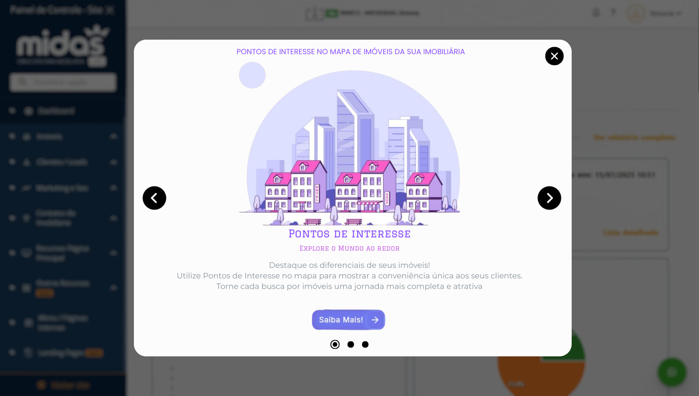

# ✨ Exercício 1 – Análise Crítica e Redesenho de Pop-up

## 📌 Análise Crítica da Versão Original

A versão original do pop-up apresentava diversos pontos que poderiam ser melhorados:

- **Layout confuso**: Elementos posicionados de forma desorganizada e com pouco espaçamento entre si.
- **Hierarquia visual fraca**: O título não se destaca como deveria, o botão não chama atenção e o texto explicativo se mistura com o restante do conteúdo.
- **Poluição visual**: A imagem de fundo (mapa) e os gráficos sobrepostos dificultam a compreensão rápida da mensagem.
- **Estilo desatualizado**: O design remete a uma interface antiga e pouco atrativa.

Diante disso, identifiquei oportunidades claras de aprimoramento e optei pelo redesenho do pop-up.

---

## 🎨 Justificativa do Redesenho

O redesenho foi motivado pela necessidade de tornar o pop-up mais legível, agradável visualmente e eficiente em termos de comunicação. A proposta nova busca:

- Reduzir a poluição visual
- Melhorar a hierarquia da informação
- Modernizar a aparência do componente
- Manter o conteúdo original (texto e imagem) de forma reorganizada

---

## ✏️ Explicação das Escolhas no Novo Layout

- **Plano de fundo mantido**: O fundo original (BG POP UP) foi preservado conforme a orientação.
- **Centralização do conteúdo**: Todos os elementos estão centralizados para facilitar a leitura e guiar o olhar do usuário.
- **Imagem temática**: Substituí o mapa sobrecarregado por uma ilustração clara de imóveis e cidade, diretamente relacionada ao tema da imobiliária.
- **Tipografia limpa e legível**: Aumentei o tamanho da fonte e usei uma combinação de cores suaves com bom contraste, melhorando a leitura.
- **Botão CTA mais moderno**: O botão "Saiba Mais!" possui forma arredondada, ícone de seta e cor destacada, tornando-se mais atrativo.
- **Espaçamento adequado**: Há maior respiro entre os elementos, o que torna o layout menos cansativo e mais amigável ao usuário.

---

## 🖼️ Proposta Redesenhada

### 🧾 Antes (original):

---

### 🎨 Depois (redesenhado):

---

## ✅ Conclusão

A nova versão representa um pop-up visualmente mais agradável, funcional e alinhado com boas práticas de UX/UI. As alterações foram feitas com o objetivo de melhorar a compreensão e a conversão sem modificar o conteúdo original, mantendo coerência com os objetivos propostos.

